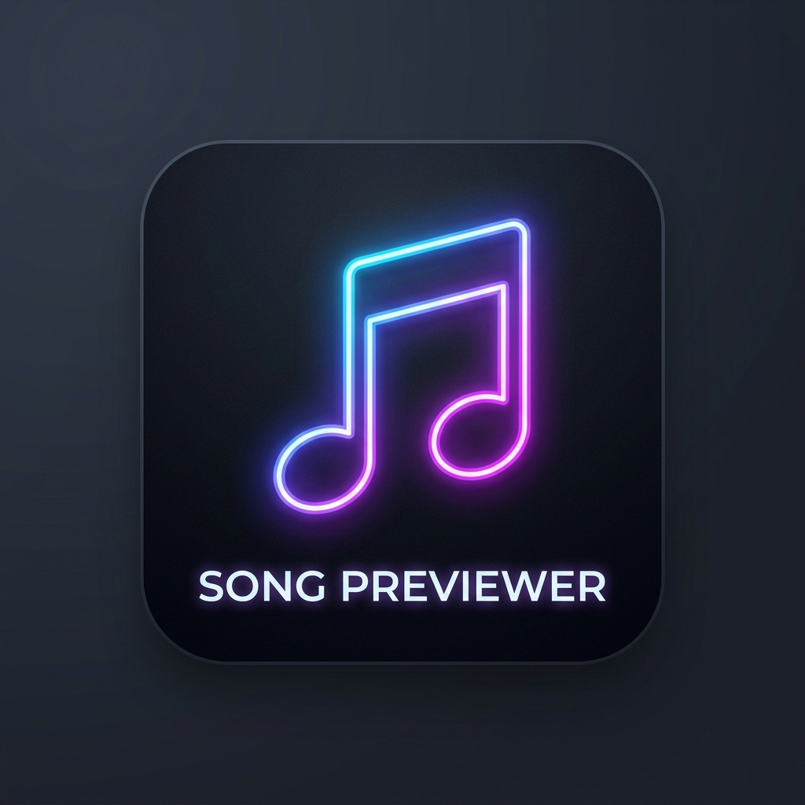

  
  <h1>🎧 Song Previewer</h1>
  
<strong>A Chrome extension that plays direct 30-second song preview whenever you highlight a song name on any webpage!</strong>

  
  
  
  

 

## ✨ Features

- 🎵 **Instant Playback:** Highlight any song title with a normal mouse drag selection to instantly hear a 30-second preview.
- 💎 **Premium Glassmorphism UI:** Features a sleek, dark-themed floating player with dynamic spring animations, high-quality typography (Inter), and beautiful background blurs.
- 🍏 **Apple Music Integration:** Searches the iTunes API first for high-quality, direct `previewUrl` audio files.
- 🎥 **YouTube Fallback:** Automatically falls back to the official YouTube iframe embed if no iTunes result is found.
- 🤖 **AI Language Lookup:** Automatically detects the language of the selected song using a silent, lightning-fast background AI. No API keys required for this mode!
- 🎛️ **Customizable UI:** Drag the album art to position the floating player anywhere on your screen. Resizable from the bottom-right corner! Your layout is remembered per-website.
- 🛑 **Quick Controls:** Simply press `Esc` or click the `x` on the floating card to stop playback instantly.

---

## 🚀 Installation

# Chrome
1. Download the **`Song Previewer.zip`** file.
2. Extract the ZIP file to a folder on your computer.
3. Open Google Chrome and go to `chrome://extensions/`.
4. Turn on the **Developer mode** toggle in the top right corner.
5. Click the **Load unpacked** button in the top left.
6. Select the folder you just extracted. You're done! 🎉

---

## ⚙️ Advanced Setup

### YouTube Player
The YouTube player uses an iframe because YouTube playback must stay inside the official YouTube player as per rules.

1. Go to the [Google Cloud Console](https://console.cloud.google.com/).
2. Create a new project and enable the **YouTube Data API v3**.
3. Create an API key.
4. Click the pinned **Song Previewer** icon `🎵` in your Chrome toolbar.
5. Click **Open settings**.
6. Paste your API key and save!

---

## 🛠️ Technical Notes

- ✅ No proxies or middleware used. The extension communicates directly with Apple and YouTube APIs!
- ⚡ **Background Polling:** The Search AI mode utilizes Chrome's Offscreen and background Service Worker capabilities to rapidly fetch AI responses without interrupting your browsing flow.
- 🔊 If Chrome blocks automatic autoplay on a site, a convenient `Play` button will appear next to your selected text.

 

  <i>Made with ❤️ for everyone</i>

